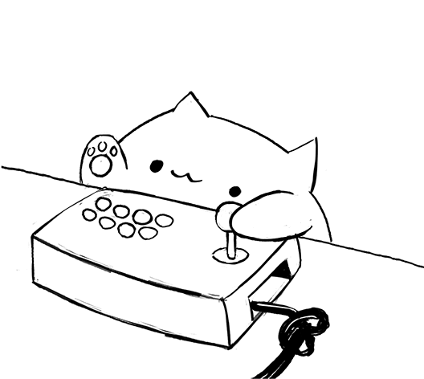

<pre style="text-align: center">
    ____                   __            __        
   / __ \___  ____  ____ _/ /____  _____/ /_  _____   
  / /_/ / _ \/ __ \/ __ `/ __/ _ \/ ___/ __ \/ ___/
 / ____/  __/ / / / /_/ / /_/  __/ /__/ / / (__  ) 
/_/    \___/_/ /_/\__,_/\__/\___/\___/_/ /_/____/
</pre>

## Penatechs is ...
here to make life paw-sitively easier for veterinary clinics! 🐾 We’re your go-to team for hassle-free shift builders, 🗓️ stress-free record management, 🐕 pet health diaries, and even making sure vacations 🏖️ are scheduled without barking up the wrong tree.         

Think of us as the tech-savvy best friend 🦴 clinics never knew they needed. With our tools, you’ll spend less time juggling admin tasks and more time making tails wag. 🐕‍🦺 We’re proud to fetch solutions that keep pet health on track and clinic workflows running like a well-trained pup. 🐶💻

#### In the pet tech world, we’re not kitten around! 🐱✨

    

