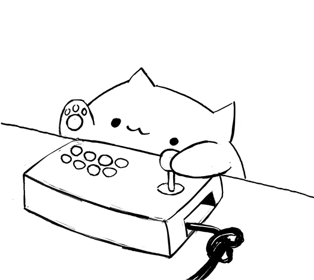

<pre style="text-align:center">
    ____                   __  _      __            _              
   / __ \___  ____  ____ _/ /_(_)____/ /_  _____   (_)____         
  / /_/ / _ \/ __ \/ __ `/ __/ / ___/ __ \/ ___/  / / ___/         
 / ____/  __/ / / / /_/ / /_/ / /__/ / / (__  )  / (__  )    _ _ _ 
/_/    \___/_/ /_/\__,_/\__/_/\___/_/ /_/____/  /_/____/    (_|_|_)
</pre>

... here to make life paw-sitively easier for veterinary clinics! 🐾 We’re your go-to team for hassle-free shift builders, 🗓️ stress-free record management, 🐕 pet health diaries, and even making sure vacations 🏖️ are scheduled without barking up the wrong tree.         

Think of us as the tech-savvy best friend 🦴 clinics never knew they needed. With our tools, you’ll spend less time juggling admin tasks and more time making tails wag. 🐕‍🦺 We’re proud to fetch solutions that keep pet health on track and clinic workflows running like a well-trained pup. 🐶💻

#### In the pet tech world, we’re not kitten around! 🐱✨

    

